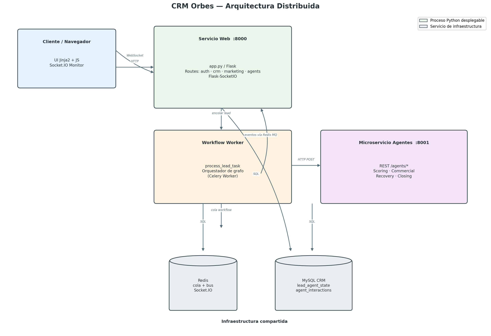
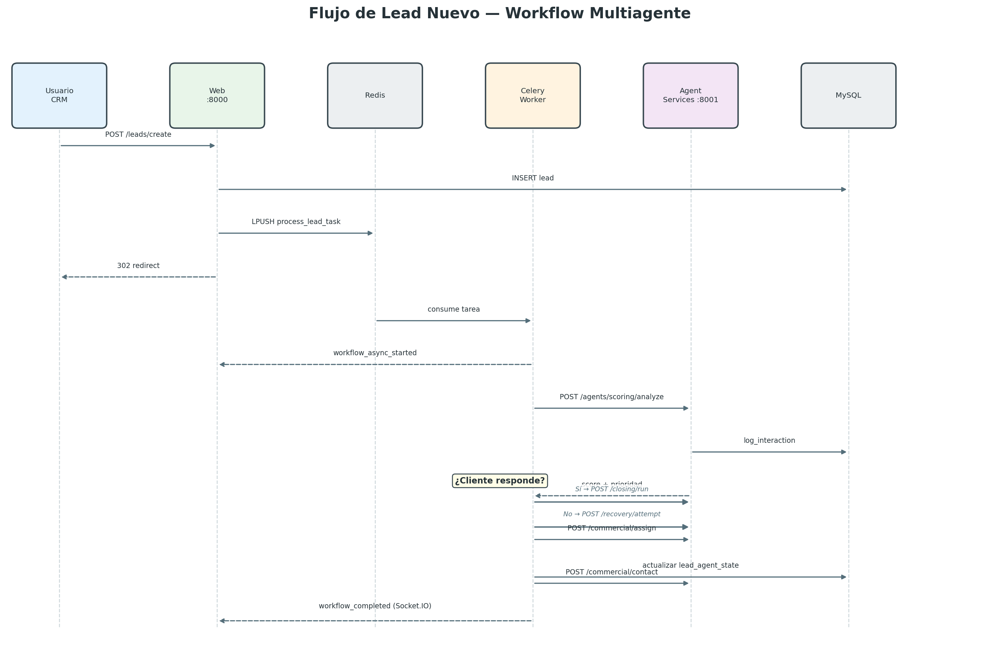
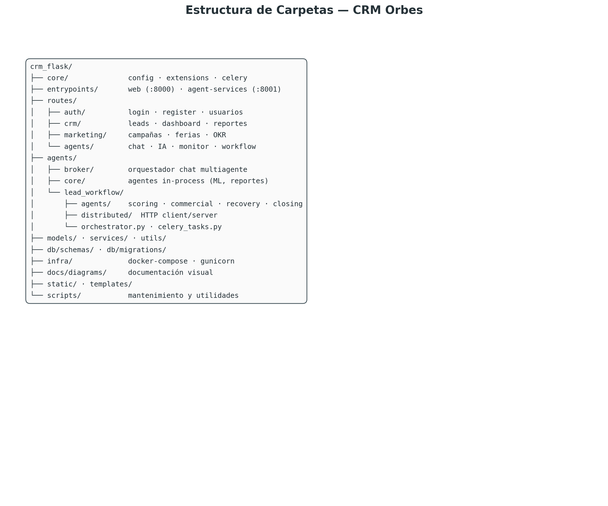
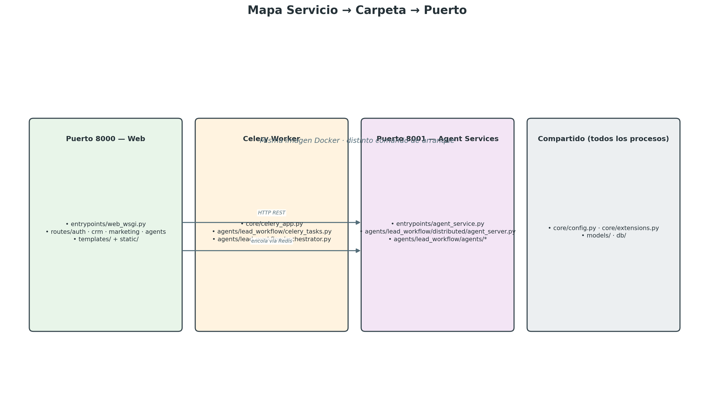

# Arquitectura Distribuida — CRM Orbes

Documento de referencia para explicar la organización del proyecto y cómo se comunican los servicios en producción.

---

## 1. Vista general del sistema

El CRM opera como **4 procesos independientes** coordinados por **Redis** y **MySQL**:



---

## 2. Flujo de un lead nuevo (workflow multiagente)



---

## 3. Modos de operación

| Variable | Valor | Comportamiento |
|----------|-------|----------------|
| `WORKFLOW_DISTRIBUTED=0` | Monolito | Orquestador llama agentes **in-process** (desarrollo local) |
| `WORKFLOW_DISTRIBUTED=1` | Distribuido | Worker delega a **Agent Services** vía HTTP |
| `USE_CELERY=1` + `REDIS_URL` | Async | Creación de lead encola tarea; sin Celery es síncrono |
| `REDIS_URL` | presente | Socket.IO usa Redis como message queue entre procesos |

Endpoint de introspección: `GET /lead_workflow/architecture?probe=1` (usa `agents/lead_workflow/distributed/architecture.py`).

---

## 4. Estructura de carpetas



<details>
<summary>Ver árbol de carpetas en texto</summary>

```
crm_flask/
├── app.py                      # Factory Flask + registro de blueprints
├── Dockerfile                  # Imagen única para los 3 servicios Python
├── docker-compose.dockploy.yml # Orquestación local/producción
├── core/                       # config, extensions, celery
├── entrypoints/                # web (:8000) y agent-services (:8001)
├── routes/                     # auth · crm · marketing · agents
├── agents/                     # broker, core, lead_workflow
├── models/ · services/ · utils/
├── db/schemas/ · db/migrations/
├── infra/ · deploy/ · scripts/
├── docs/diagrams/              # Diagramas PNG
├── static/ · templates/
└── generated_tools/
```

</details>

---

## 5. Mapa servicio → carpeta → puerto



---

## 6. Endpoints REST del microservicio de agentes

| Método | Ruta | Agente |
|--------|------|--------|
| POST | `/agents/scoring/analyze` | LeadScoring (+ 4 sub-análisis) |
| POST | `/agents/commercial/assign` | CommercialAssistant |
| POST | `/agents/commercial/contact` | CommercialAssistant |
| POST | `/agents/recovery/attempt` | RecoveryAgent |
| POST | `/agents/recovery/mark-dead` | RecoveryAgent |
| POST | `/agents/closing/run` | ClosingAgent |
| GET | `/healthz` | Health check |

Autenticación interna opcional: header `X-Internal-Secret` si `INTERNAL_SERVICE_SECRET` está definido.

---

## 7. Cómo levantar el stack distribuido

```bash
# Desde la raíz del proyecto
docker compose -f docker-compose.dockploy.yml up -d

# Servicios resultantes:
#   app              → http://localhost:8000
#   workflow-worker  → Celery consumer
#   agent-services   → http://localhost:8001 (interno)
#   redis            → broker
#   mysql            → base de datos
```

Desarrollo local (monolito, sin Docker):

```bash
# Terminal 1 — web
python app.py

# Terminal 2 — worker (opcional)
celery -A core.celery_app.celery worker -Q workflow -l info

# Terminal 3 — agent services (opcional, si WORKFLOW_DISTRIBUTED=1)
python -m gunicorn -b 0.0.0.0:8001 entrypoints.agent_service:app
```

---

## 8. Diagramas PNG (todos en `docs/diagrams/`)

| Archivo | Descripción |
|---------|-------------|
| `arquitectura_distribuida_general.png` | Vista general: Web, Worker, Agent Services, Redis, MySQL |
| `flujo_lead_workflow.png` | Secuencia completa al crear un lead |
| `mapa_servicios_carpetas.png` | Qué carpeta corresponde a cada proceso |
| `estructura_carpetas.png` | Árbol de carpetas del proyecto |
| `comunicacion_agentes_socketio.png` | Eventos Socket.IO entre agentes |
| `stack_tecnologico_crm_orbes.png` | Stack tecnológico |

Regenerar los diagramas de arquitectura:

```bash
python scripts/generar_diagramas_arquitectura.py
```

---

## 9. Documentación relacionada

| Archivo | Contenido |
|---------|-----------|
| `docs/SISTEMA_ACTUAL.md` | Módulos funcionales del CRM |
| `docs/AGENTS_INTELIGENTES.md` | Capa de agentes conversacionales |
| `docs/DEPLOY_DOCKPLOY_HOSTINGER.md` | Despliegue en VPS |
| `docs/QUICK_REFERENCE.md` | Referencia rápida |

---

*Última actualización: reorganización de carpetas para arquitectura distribuida — 2026-06-15*
